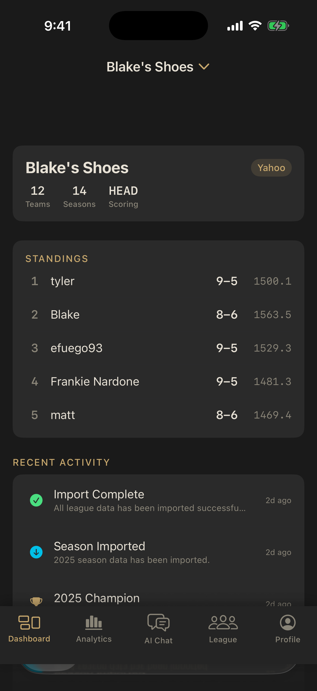
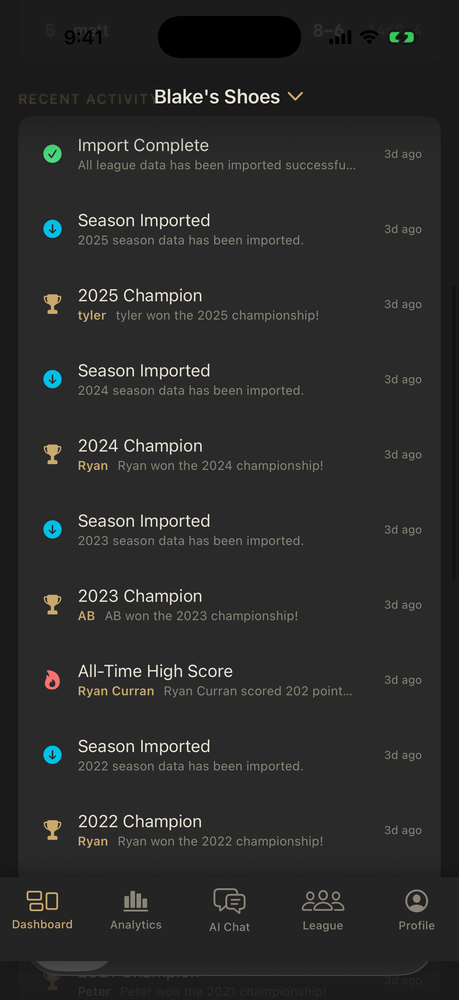
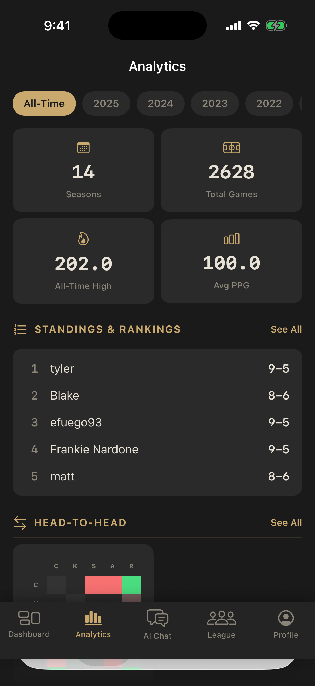
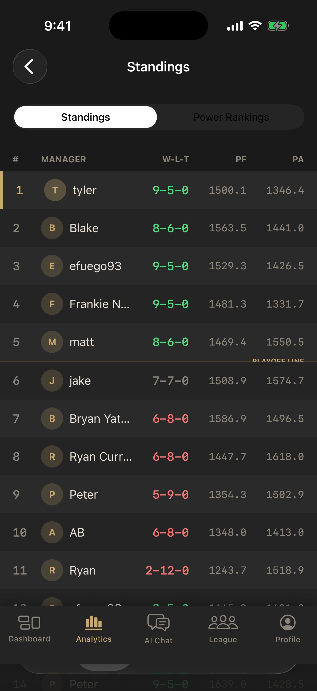
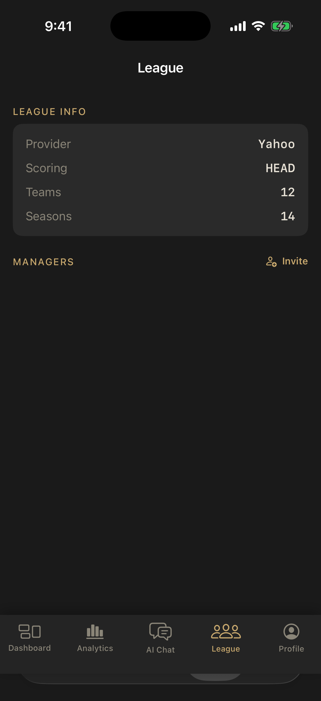

# Fantasy League Hub

iOS fantasy football analytics app that connects Yahoo and Sleeper leagues to aggregate years of history into deep analytics — head-to-head records, scoring trends, draft grades, playoff performance, and a personalized career dashboard.

Built end-to-end with [Claude Code](https://claude.ai/code) as a portfolio demonstration of AI-assisted full-stack iOS product development.

---

## Screenshots

<p float="left">
  
  
  
  
  
</p>

---

## Features

**Data & Sync**
- Yahoo (OAuth) and Sleeper adapters with full historical season discovery via linked league chains
- Full and incremental sync via BullMQ job queue — skips unchanged past seasons on re-sync
- League invite system — generate share links, join via `fantasyhub://invite/{code}` deep links

**Analytics**
- **Standings** — season standings with power rankings tab
- **Head-to-Head** — rivalry heatmap grid + individual matchup breakdown
- **Scoring Trends** — multi-season line chart with 4-week rolling average, luck index
- **Draft** — letter-grade report cards, visual draft board by round and position (color-coded by position)
- **Records** — all-time top/bottom scores, nail-biters, blowouts, champions, score distribution
- **Playoff Performance** — clutch ratings, regular season vs playoff PPG comparison
- **Insights** — 7 auto-generated insight types: streaks, rivalries, consistency, clutch, records, PPG comparison, heartbreak

**Personal Dashboard**
- Manager claim — link your identity across Yahoo and Sleeper seasons
- Career hero card with all-time W-L-T, win rate, championships, PPG sparkline (last 20 weeks)
- Rival card — best and worst rivals with win/loss bars
- Rank trajectory chart — season-by-season finish, inverted y-axis
- Superlatives — 9 earned badges: Sniper, Boom or Bust, Playoff Machine, Dynasty Builder, Clutch Gene, Rival Slayer, Heartbreak Kid, Blowout Artist, Iron Man

---

## Tech Stack

| Layer | Technology |
|-------|-----------|
| iOS | SwiftUI, Swift Charts, iOS 17+, Swift 6.0 |
| API | Node.js, Express 5, TypeScript |
| Database | PostgreSQL 17, Prisma ORM |
| Queue | BullMQ (Redis) |
| Auth | Clerk (iOS SDK + Express middleware) |
| AI _(V2, planned)_ | RAG + Tool Use, pgvector, OpenAI |

---

## Architecture

```
iOS App (SwiftUI + Swift Charts)
    │  HTTPS + Clerk session tokens
    ▼
Express API (Node.js / TypeScript)
    │  Prisma ORM
    ▼
PostgreSQL (13 tables)
    ▲
BullMQ Workers (sync jobs, Redis)
    ▲
Yahoo Fantasy API (OAuth 2.0)
Sleeper API (public REST)
```

The API follows a provider adapter pattern — each fantasy platform implements a common `ProviderAdapter` interface, making it straightforward to add new data sources. See [`docs/architecture/overview.md`](docs/architecture/overview.md) for the full system diagram and data flows.

---

## Local Setup

### Prerequisites

- Node.js 22+
- PostgreSQL 17 — `brew install postgresql@17`
- Redis — `brew install redis`
- Xcode 16+ with iOS 17 SDK
- [XcodeGen](https://github.com/yonaskolb/XcodeGen) — `brew install xcodegen`

### API

```bash
# Start services
brew services start postgresql@17
brew services start redis

# Install and configure
cd api
npm install
cp .env.example .env
# Fill in your Clerk and Yahoo OAuth credentials in .env

# Set up database
npx prisma migrate dev

# Run
npm run dev   # API on http://localhost:3000
```

### iOS App

```bash
cd ios
xcodegen generate
open FantasyHub.xcodeproj
```

Set your Clerk publishable key in `FantasyHub/App/FantasyHubApp.swift`, then build and run on an iOS 17+ simulator.

---

## Technical Decisions

All major architecture decisions are documented in [`.decisions/`](.decisions/) — 28 HTML decision records covering platform selection, data modeling, provider integration strategy, auth and multi-tenancy, and the V2 AI chat architecture. Open `.decisions/index.html` locally to browse them as a dashboard.

---

## AI-Assisted Development

This project was designed and built end-to-end using Claude Code. The `.decisions/` archive documents how AI-assisted design thinking shaped each architecture choice. Feature specs in [`docs/features/`](docs/features/) were written before implementation and served as the source of truth for both API shape and iOS view hierarchy.

The goal was to treat AI not as an autocomplete tool but as a design collaborator — forcing explicit decisions, documented tradeoffs, and specs before code.

---

## Roadmap

**V1 — Core Analytics** _(current)_
Yahoo + Sleeper sync, 8 analytics modules, personal dashboard, shimmer loading states, error handling

**V2 — AI Chat** _(planned)_
RAG-backed conversational analytics, pgvector embeddings, ESPN adapter, weekly recap generation

**V3 — Engagement** _(planned)_
Trade analyzer, waiver wire recommendations, playoff probability models, league awards
